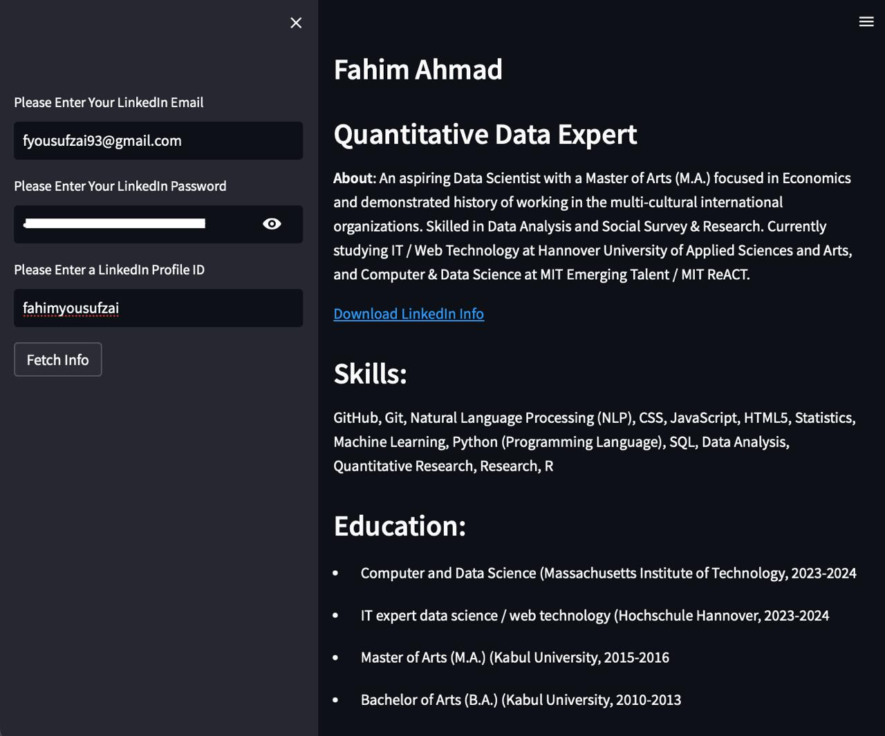

I developed this app using streamlit in python for learning purposes only.

It takes a LinkedIn user id as input and displays profile data, skills, education, etc. in the main page with a link to export the data in a csv file.

How to use the app?

- clone or download the repository
- open terminal and find the location of the cloned/downloaded repository
- execute 'streamlit run app.py'

